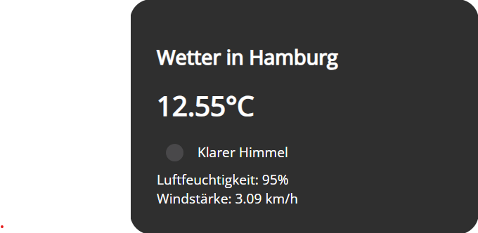

# Weather App 🌦️



**Weather App** is a simple weather application that displays the current weather for various state capitals of Germany. The app fetches weather data from the OpenWeatherMap API and updates the information every 30 seconds with a new city.

Demo : (https://codepen.io/xcruser/details/wvQYjWW)
## How it works 🔄

The Weather App is built using HTML, CSS, and JavaScript. It utilizes the OpenWeatherMap API to fetch weather data for different cities. The app displays the current weather, temperature, humidity, and wind speed for each city. The list of state capitals of German states is predefined in the JavaScript code.

The app loads the weather data for the first city (in this case, "Erfurt") and then updates the display every 5 minutes with data for a new city from the predefined list.

## Usage 🚀

To use the Weather App, simply open the `index.html` file in a web browser. The app will automatically load weather data for different cities and update the display every 5 minutes.

## Customization ✏️

If desired, you can customize the list of cities in the weather.js file to add more state capitals or modify existing ones. Additionally, to make the background visible again under the .card parameter, you can uncomment or remove the background-color property in the .card class. Similarly, you can set the color property to "white" or any other color of your choice in the .card and .weather.loading:after classes to customize the text color.

## Note: Setting Up the API Key

The API key must be set up in the `weather.js` file to successfully use the Weather App. Please follow the instructions below to correctly store the API key:

1. **Obtain an API Key from OpenWeatherMap:**

    - Visit the OpenWeatherMap website (https://openweathermap.org/) and create a free account.
    - Log in and go to your Dashboard.
    - Click on "API Keys" or "My API Keys" to generate your personal API key.
    - Create a new API key and give it a name (e.g., "Weather App Key").

2. **Set Up the API Key in the `weather.js` file:**

    - Open the `weather.js` file in the main directory of your project.
    - Locate the following line in the code:

   ```javascript
   let weather = {
       apiKey: "YOUR_OPENWEATHERMAP_API_KEY",
       // The rest of the code remains unchanged...
   };

Replace "YOUR_OPENWEATHERMAP_API_KEY" with the API key you obtained from OpenWeatherMap.
Important:

Make sure not to publish the modified code when uploading your project to GitHub to keep your API key private. Remember not to publish the file or exclude it from your repository if you've already done so.
By following these steps, your API key will be correctly set up in the Weather App, allowing you to seamlessly retrieve weather data from OpenWeatherMap.

javascript
Copy code
// List of German state capitals
cities: [
"Berlin",      // Berlin
"Hamburg",     // Hamburg
// Add more state capitals here...
],
